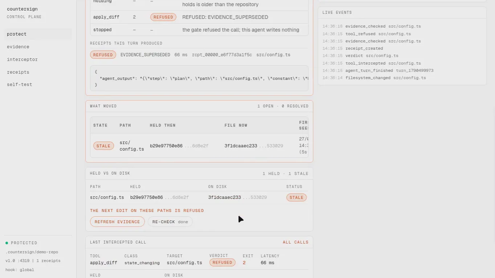
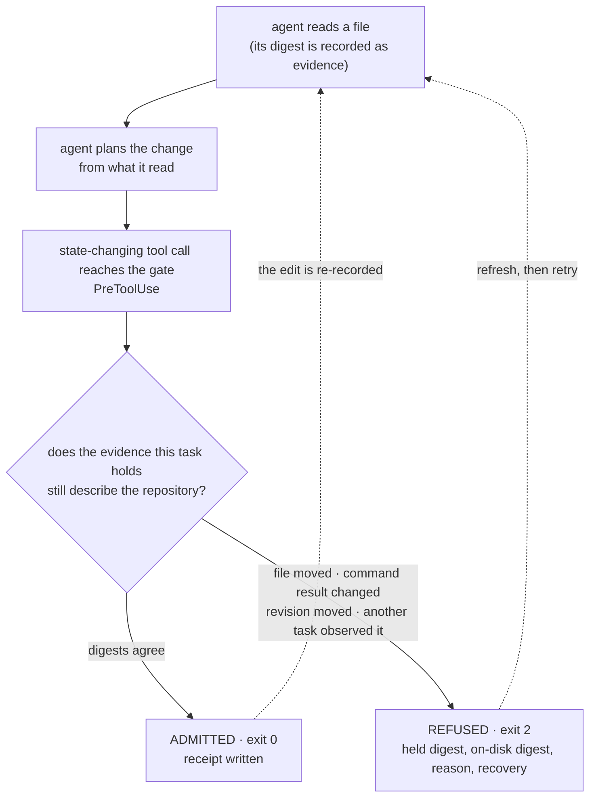
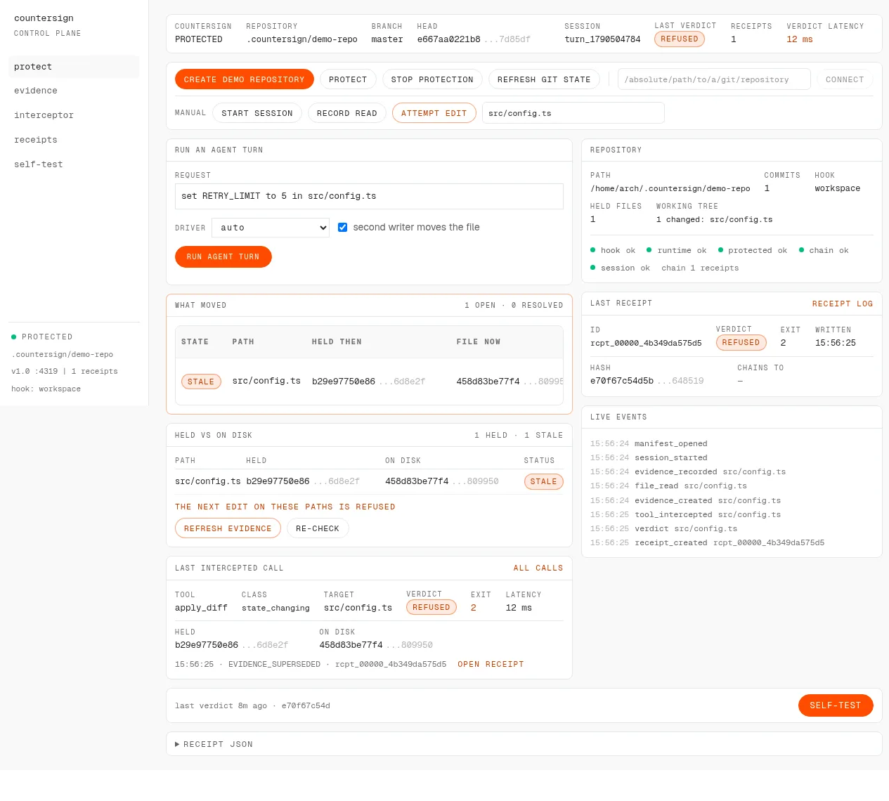
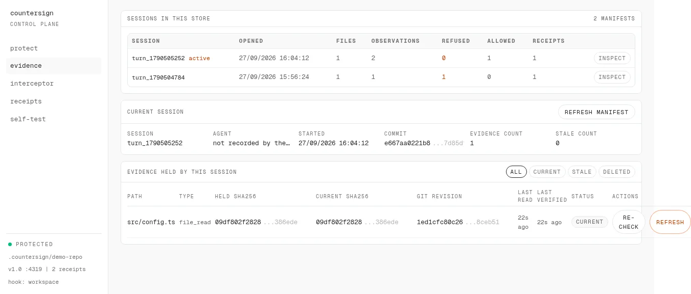
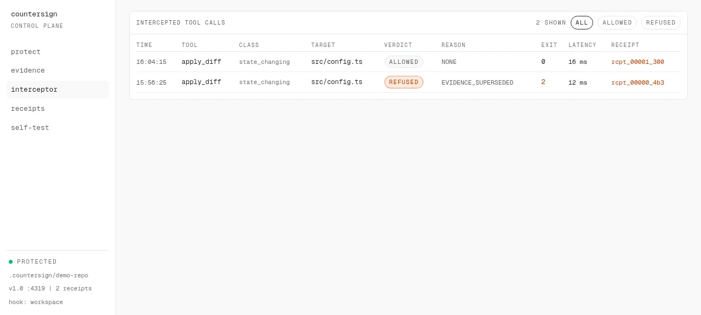
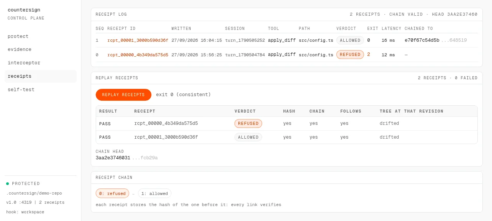
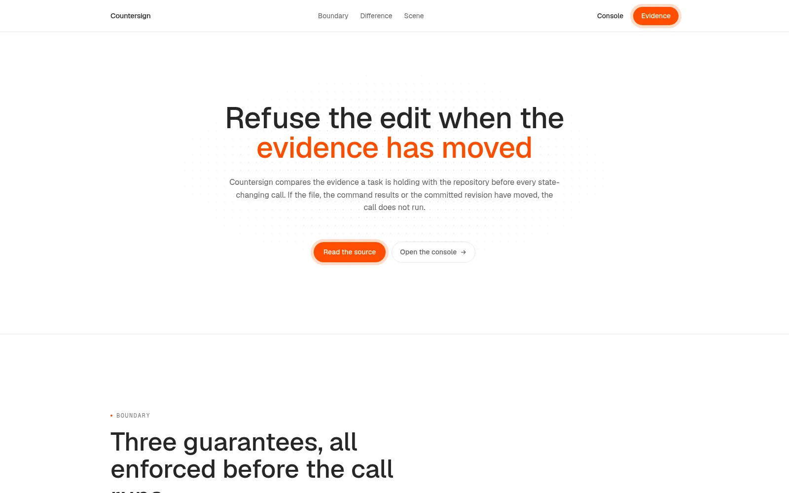
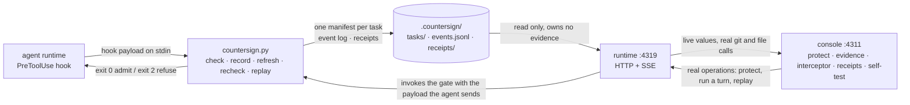

<div align="center">

# COUNTERSIGN

### A local control plane that refuses an agent's edit when the evidence behind it no longer describes the repository.

[](#tests)
[](#-see-it-in-one-command)
[](#what-the-gate-measures)
[](LICENSE)


[](https://youtu.be/NQ43DN8eA8I) [](docs/media/countersign-demo.mp4) [](#whats-real-vs-pending--the-honesty-table) [](#-see-it-in-one-command)

</div>

An agent reads a file, `src/config.ts` in the demonstration repository, decides what to change, and asks to write it. Between the read and the write the file can change, the branch can move, a recorded command can return something else, and none of that appears anywhere in the transcript. Most agent stacks answer the easy question, _did the tool call succeed?_ Countersign answers the harder one: **is the evidence this task is holding still an accurate description of the repository the call is about to change?** It is a gate in front of the write, not a reviewer after it. When the answer is no the call does not run, the exit code is 2, and the refusal names the digest the task held, the digest on disk, the reason and the recovery steps.

```
OBSERVED  ≠  CURRENT   ⇒   REFUSED (exit 2)
```

There is no `WARNED` and no `ADMITTED_WITH_NOTES`. Either the evidence a task holds describes the repository at the moment of the call, or the state-changing call is refused and says which fact moved.

## Run it

```
git clone https://github.com/subheeksh5599/countersign && cd countersign
sh install.sh --global     # the gate, the CLI wrapper, and the hook block
sh run.sh                  # runtime on :4319, console on http://127.0.0.1:4311/console
```

Verified on a fresh clone: the install is idempotent, and `run.sh` installs the console's dependencies on its first run, builds it, starts both processes and prints the URL. Nothing else is required. `sh run.sh --runtime-only` skips the console, and `COUNTERSIGN_WORKSPACE=/path/to/repo sh run.sh` points the runtime at a repository you already have.

## Live status

**The gate, the runtime and the console are implemented and exercised on this machine.** `python3 scripts/acceptance.py` drives 21 steps against a live runtime and reports **21 passed, 0 failed**: it creates a repository, connects it, protects it, opens a session, records a read, changes the file from a second process, attempts the edit, reads the refusal, refreshes the evidence, retries, verifies the chain and runs the self-test.

| Surface | Status | The evidence |
|---|---|---|
| Gate | **LIVE** | `python3 tests/test_gate.py` 15/15 — `test_matrix.py` 500/500 — `test_receipts.py` 16/16, each building a real git workspace and running the gate as a subprocess |
| Runtime | **LIVE** | `http://127.0.0.1:4319`, serving the store the gate wrote; one decision measured at 308 ms against a 200 observation manifest |
| Console | **LIVE** | five pages at `http://127.0.0.1:4311/console`, reading that runtime over HTTP and SSE; with the runtime down every page says `DISCONNECTED` and prints the start command |
| Real refusal from a real agent session | **REFUSED** | task `eea2941f4db4a1f67c401695b74446d0` — 1.05 Bobcoin, 44.6 s, 4 state-changing attempts, **4 refused with exit 2 / `EVIDENCE_SUPERSEDED`**, 4 chained receipts, file untouched ([`docs/LIVE_RUN.md`](docs/LIVE_RUN.md)) |
| Refusal on the real hook path | **REFUSED** | the payloads a live session emitted, replayed through the same modes the installed hook invokes: `apply_diff` → exit 2, `EVIDENCE_SUPERSEDED`, held `baa5252515ea` vs on disk `f24af5254d22` ([`docs/HOOK_RUN.md`](docs/HOOK_RUN.md), `sh scripts/replay_real_refusal.sh`) |
| Receipts and chain | **VERIFIED** | every verdict persists a receipt; `countersign replay` re-derives each one from the inputs it recorded. Latest run: `2 receipts, 0 failed. chain head 3aa2e3746031` |
| Replay as a CI gate | **GREEN** | [`.github/workflows/replay.yml`](.github/workflows/replay.yml) replays a committed store on every push, then forges a verdict and asserts the replay **fails**. Locally the forged store exits 2: `3 receipts, 1 failed. chain head 2e35c04a89ac` |
| Hosted pages | **LIVE** | product site [countersign-eight.vercel.app](https://countersign-eight.vercel.app), published record [subheeksh5599.github.io/countersign](https://subheeksh5599.github.io/countersign/) |
| Verify the record in a browser | **LIVE** | [countersign-eight.vercel.app/record](https://countersign-eight.vercel.app/record) recomputes the four receipts a real session wrote, client side, and prints the chain head it computes beside the one the CLI prints; both read `e83186b797d1a732…`. Two controls edit a copy of a receipt in the tab and the checks turn to `FAIL`, which is the failure CI catches. A Node run of the same port reproduces the CLI's per-receipt hashes exactly. |

Nothing in this repository reports a credential or a service as reachable that is not. The only unconfigured path is the vendor CLI driver, and the console names the driver that actually ran: the vendor driver needs the CLI on this machine's PATH and its key in the runtime's environment, and the bundled reference driver needs neither.

## ▶ Demo

[](https://youtu.be/NQ43DN8eA8I)

**[▶ Watch the demo (1:12)](https://youtu.be/NQ43DN8eA8I)** &nbsp;·&nbsp; **[ Verify the record in your browser ↗ ](https://countersign-eight.vercel.app/record)** &nbsp;·&nbsp; **[ Local copy ↗ ](docs/media/countersign-demo.mp4)** &nbsp;·&nbsp; **[ The intro on its own ↗ ](docs/media/countersign-intro.mp4)** &nbsp;·&nbsp; **[ Posted on X ↗ ](https://x.com/KomariS18774/status/2104154580519178708)** &nbsp;·&nbsp; **[ What's real vs pending ↗ ](#whats-real-vs-pending--the-honesty-table)**

_One take, website only, no terminal and no editor: every panel is filled by a real run of the same gate the test suite drives._ It opens on a 26.5 s composition that states the failure, then shows the console refusing a real agent turn, the record it leaves behind, and the receipt replay.

The narration walks the argument: an agent reads a file and acts on what it read; by then the file may say something else; Countersign compares what the task holds with the repository as it is now; different, and the edit does not run. Then the console: pick a repository, protect it, run one real turn with a second process rewriting the file inside the window, and watch the first receipt come back `REFUSED: EVIDENCE_SUPERSEDED` with both digests; the evidence page counting refusals and admissions per session; the interceptor listing every call with its class, verdict and exit code; and the receipts page replaying both receipts, `2 receipts · 0 failed`, chain head shown. Rebuilding it, what was cut and why, and the measured voice: [`demo/NARRATION.md`](demo/NARRATION.md).

## The 20-second pitch

An agent reads a config file, plans an edit, and applies it eight minutes later. In those eight minutes a colleague merges a branch, a formatter rewrites the file, or the agent's own compaction drops the part of the transcript that would have said so. The write lands, the tool call reports success, and the repository now holds an edit derived from text that was never true of this file. Nothing in the stack is looking for that: the file existed, the write succeeded, the diff applies cleanly.

The second wound is quieter — and invisible from inside the tool. The agent's context says the file holds `b29e97750e86`. The file holds `458d83be77f4`. The transcript keeps reading from the old text, and the documented recovery is for a person to notice and start a new task.



## Table of contents

- [Run it](#run-it)
- [Live status](#live-status)
- [▶ Demo](#-demo)
- [The 20-second pitch](#the-20-second-pitch)
- [Table of contents](#table-of-contents)
- [▶ See it in one command](#-see-it-in-one-command)
- [Screenshots](#screenshots)
- [Verify every claim in one command](#verify-every-claim-in-one-command)
- [What Countersign is NOT](#what-countersign-is-not)
- [The problem I set out to solve](#the-problem-i-set-out-to-solve)
- [What I built](#what-i-built)
- [Architecture](#architecture)
- [The gate, step by step](#the-gate-step-by-step)
- [Where the guarantee is enforced](#where-the-guarantee-is-enforced)
- [What the gate measures](#what-the-gate-measures)
- [Where the model sits](#where-the-model-sits)
- [Who approves what](#who-approves-what)
- [Engineering decisions & the traps that taught me something](#engineering-decisions--the-traps-that-taught-me-something)
- [What's real vs pending — the honesty table](#whats-real-vs-pending--the-honesty-table)
- [Attack → test](#attack--test)
- [The app](#the-app)
- [Limitations](#limitations)
- [Security](#security)
- [Tech stack](#tech-stack)
- [Project layout](#project-layout)
- [Full command reference](#full-command-reference)
- [How I'd deploy it](#how-id-deploy-it)
- [Results and supporting records](#results-and-supporting-records)
- [Tests](#tests)
- [License](#license)

## ▶ See it in one command

```bash
$ python3 tests/test_gate.py
15/15 passed

$ python3 tests/test_matrix.py -j 6
500/500 passed

$ python3 tests/test_receipts.py
16/16 passed
```

```bash
$ python3 scripts/acceptance.py
  PASS  18. every manifest in the store is listed, not only the newest
        1 manifests; this session refused 1 and allowed 1
  PASS  19. a move the watcher saw is recorded in the store with a time on it
        recorded after 0s: 1 open transition(s) for src/config.ts, first seen 2026-09-27T10:40:41Z status STALE
  PASS  20. one agent turn against the protected repository is refused by the gate
        driver reference, agent exit 2, 1 receipt(s), EVIDENCE_SUPERSEDED in 515 ms
  PASS  21. every stored verdict is re-derived from its own recorded inputs
        3 receipts replayed, 0 failed, exit 0, chain head 030b11493629

21 passed, 0 failed
```

```bash
$ COUNTERSIGN_WORKSPACE=/path/to/repo countersign status
countersign
  workspace      /home/arch/.countersign/demo-repo
  store          /home/arch/.countersign/demo-repo/.countersign
  sessions       2 manifest(s), newest turn_1790505252
  active session turn_1790505252
  held evidence  1 file(s), 0 no longer matching
  receipts       2 (1 refusal(s), 1 admission(s))
  chain          valid (2/2 link and hash checks pass)
  modes          session-start, record, check, refresh, recheck, replay, status, probe, export
```

```bash
$ COUNTERSIGN_WORKSPACE=/path/to/repo countersign replay
PASS  rcpt_00001_3000b590d36f  ADMITTED NONE                       hash_recomputes=yes chain_links=yes verdict_follows_from_inputs=yes
        held == current 458d83be77f4, a digest refusal would be a contradiction
        src/config.ts at e667aa02: drifted

2 receipts, 0 failed. chain head 3aa2e3746031
```

Four gates, not four screenshots. The suites build real workspaces and run the gate as a subprocess, so a pass means an exit code was observed. The acceptance run drives the running runtime end to end. `status` and `replay` read the store a hook actually wrote, and `replay` recomputes verdicts from the inputs each receipt recorded rather than trusting the verdict it stored.

## Screenshots

Real captures of the running console, taken from the same store the demo was recorded against. Each one is captioned from what is on it.

**The refusal — and the two digests that caused it.** `src/config.ts` was read at `b29e97750e86`; the file on disk is now `458d83be77f4`; the row reads `STALE`, the verdict reads `REFUSED`, the reason reads `EVIDENCE_SUPERSEDED`, the exit code is 2, the decision took 12 ms, and the receipt is `rcpt_00000_4b349da575d5`. The footer under the table states the consequence in five words: the next edit on these paths is refused.

[](docs/media/countersign-console-refused.png)

**Every session keeps its own manifest.** Two sessions in one store, each with its own counts: `turn_1790504784` refused 1 and allowed 0, `turn_1790505252` refused 0 and allowed 1. Evidence does not leak between tasks, so a fresh task has to observe a path before it can change it.

[](docs/media/countersign-console-sessions.png)

**Every intercepted call, classified.** Two calls to the same path — an `apply_diff` classed `state_changing` that was `ALLOWED` at exit 0 in 16 ms, and the earlier one `REFUSED` at exit 2 in 12 ms with the reason `EVIDENCE_SUPERSEDED`. Each row carries its receipt.

[](docs/media/countersign-console-interceptor.png)

**Replaying the receipts — the verdict is checkable after the fact.** Pressing replay re-derives both verdicts from the inputs each receipt recorded: `2 receipts · 0 failed`, every row `PASS` with hash recomputed, chain link and verdict-follows all `yes`, and the chain head printed. The tree column reads `drifted` for both rows because the admitted turn then rewrote the file; that observation is recorded, not scored.

[](docs/media/countersign-console-receipts.png)

**The claim on the site.** One line and the two things you can do about it: read the source, or open the console.

[](docs/media/countersign-landing.png)

## Verify every claim in one command

```bash
$ python3 tests/test_gate.py && python3 tests/test_matrix.py -j 6 && python3 tests/test_receipts.py && python3 scripts/acceptance.py
```

That is the whole evidence chain: 531 cases plus the 21 step live run. The receipts from the run above stay on disk under `.countersign/receipts/`, so `countersign replay` reads the same artifacts afterwards.

## What Countersign is NOT

It is not a linter, a reviewer, or a model that grades a diff. It reads no prose and scores no style.

It is not a sandbox. It does not stop an agent from reading anything, and it does not contain a running process. It sits at the one moment that matters: the state-changing call, before it runs.

It is not a rollback tool. Rollback undoes an edit that already landed; this refuses the edit, so there is nothing to undo. The two are complements, and the second is only as good as the first detecting the change.

It is not a merge conflict resolver. A conflict is what version control reports when two committed versions meet. This is about a task holding facts that were true when it read them and are not true now, which version control never reports because nothing conflicted.

It is not organisation-wide enforcement. See [Limitations](#limitations); the hook is installed per workspace or per machine, and what travels between machines is the receipt, not the block.

## The problem I set out to solve

Agent runtimes document three properties that combine badly. Compaction is lossy, so early context may not survive. Once wrong context is in the transcript it persists, and the runtime does not reliably ignore plausible text just because it is wrong. One listed cause is stale or wrong repository text misleading file reads. The documented recovery is to start a new task, which requires a person to notice first.

Meanwhile the file itself keeps changing. Editors write on save, formatters rewrite on commit, a second agent works the same tree, a colleague pushes. Every one of those is invisible from inside the transcript, because a transcript records what a tool call returned, not whether that answer is still true.

So the failure mode is this — a task holds an accurate reading of a file, the file moves, and the task's next write uses the stale reading. No error is raised anywhere. The write is well-formed, the diff applies, and the resulting code is derived from a version of the file that no longer exists. The only defence documented is a human noticing.

## What I built

A gate (`countersign.py`) that runs as a `PreToolUse` hook, a local runtime (`runtime/countersign_runtime.py`) that reads the store the gate writes, and a console (`landing/`) that drives the mechanism through real operations instead of describing it. State lives in `.countersign/` inside the protected repository: one manifest per task, an append-only event log, and one receipt file per verdict.

The unit is the task — not the file. Each task opens a manifest when its session starts. Reads record digests into it; the check consults it. That is what makes `CROSS_TASK_EVIDENCE` possible as a refusal: a path observed only by another task is not evidence this task can change it. It also means a resumed task keeps what it already read, which is why `session-start` on an existing manifest never erases it.

## Architecture



| Component | What it owns | What it must never do |
|---|---|---|
| `countersign.py` | the verdict, the store, the receipts | consult a model, or admit when it cannot read its input |
| `runtime/countersign_runtime.py` | reading the store, real git and file measurements, SSE fan-out | invent a value the store does not hold, or keep its own copy of the truth |
| `landing/` (console) | rendering live values and issuing real operations | hold sample data, or fake an intercepted call from frontend JavaScript |
| `.countersign/` | tasks, events, receipts | be written by anything except the gate |

The runtime holds no evidence. Every value it serves comes from the store the gate wrote or from a real `git` or filesystem call made at request time, and the console holds no sample data at all: when the runtime is unreachable each page prints `DISCONNECTED` with the command that starts it.

## The gate, step by step

Each mode is invoked by a hook event or by a person, over a store on disk.

| Mode | Hook event | What it does |
|---|---|---|
| `session-start` | SessionStart | opens an evidence manifest for this task (resuming one keeps its evidence) |
| `record` | PostToolUse | records the digest of every file read and every command result |
| `check` | PreToolUse | admits, or refuses with exit 2, the proposed state-changing call |
| `refresh` | console | re-hashes the evidence this task holds and rewrites the manifest |
| `recheck` | console | the same decision as a dry run: writes no receipt and no event |
| `replay` | terminal, CI | recompute every stored verdict from the inputs the receipt itself recorded |
| `status` | terminal | what this workspace's store holds: manifests, the active session, stale held files, receipts by verdict, whether the chain holds |
| `export` | terminal | write one hashed evidence record per task |
| `probe` | any event | records the raw payload, never blocks, so live field names can be learned |

A refusal is a decision about a fact, and each fact has its own code:

| Code | Meaning |
|---|---|
| `EVIDENCE_SUPERSEDED` | the file changed after this task observed it |
| `CROSS_TASK_EVIDENCE` | the only recorded evidence for the path belongs to a different task |
| `COMMAND_RESULT_CHANGED` | rerunning a recorded command produced a different result |
| `UNSUPPORTED_SUBTASK_EVIDENCE` | a change was attributed to a subtask that never observed the path |
| `REVISION_MOVED` | the path was committed at a different revision after the task observed it |
| `UNVERIFIED_TARGET` | policy requires prior observation and there is none |
| `NO_MANIFEST` | nothing recorded — therefore nothing verifiable, so it fails closed |

The order is deliberate: the cheapest and most specific check runs first, and the last one exists so that an empty store refuses rather than allows. A missing manifest is a refusal, an unreadable payload is a refusal, and a payload that is valid JSON but not an object is a refusal.

At a terminal, `countersign status` reads the store in the current workspace and prints exactly that, and `countersign --help` prints the contract. A mistyped mode names the modes and exits 2 rather than waiting for a payload no hook will send.

## Where the guarantee is enforced

| Guarantee | Module | The test that covers it |
|---|---|---|
| A state-changing call whose target moved since the task read it never runs | `countersign.py` (`check`) | `tests/test_gate.py`, `tests/test_matrix.py` |
| Evidence from another task cannot authorise this task's write | `countersign.py` | `tests/test_matrix.py` |
| A recorded command that now returns something else is a refusal | `countersign.py` | `tests/test_matrix.py` |
| An unrecognised tool, an unreadable payload, or no manifest fails closed | `countersign.py` | `tests/test_gate.py` and the fail-closed cases in the matrix |
| Every verdict persists a receipt whose hash recomputes | `countersign.py` | `tests/test_receipts.py` |
| A store replays on a machine where the gate never ran | `countersign.py replay` | `tests/test_receipts.py`, `.github/workflows/replay.yml` |
| A forged verdict fails the replay | `scripts/forge_a_verdict.py` | `.github/workflows/replay.yml` |
| Credentials in a payload never reach the receipt | `countersign.py` (redaction) | `tests/test_receipts.py` |
| The whole sequence works on a fresh machine, end to end | `scripts/acceptance.py` | the 21 step run above |

## What the gate measures

308 ms for a check against a manifest holding 200 observations, including the `git` commit read (mean of 20 runs, a two core laptop). The hook timeout is 10 s by default and can be overridden, so the decision spends about 3% of its budget. One measured refusal inside a live agent turn, from the acceptance run above: `EVIDENCE_SUPERSEDED in 515 ms`.

It never spends tokens. The verdict is a digest comparison and a manifest lookup, and there is no model call site in the decision path at all. That is why the gate can run on every state-changing call rather than on a sample of them, which is the property that makes the guarantee worth having.

## Where the model sits

Nowhere in the verdict. A model may propose an edit; the gate decides whether that edit may run, and the gate's decision is arithmetic over file digests, task identity and commit identity. The reference driver used in the demo (`runtime/reference_agent.py`) is deterministic and has no model and no key, so the demo's refusal is reproducible byte for byte.

The vendor driver exists for the honest case where the agent is a real product: it runs the vendor CLI the same way, with `COUNTERSIGN_WORKSPACE` pointed at the protected repository, and it is refused by the same gate. Which driver ran is named in the console result, so nothing is claimed about a driver that was not available on the machine.

## Who approves what

The gate approves. When evidence disagrees with the repository, the gate has no discretion: it refuses, and the recovery steps are printed with the refusal. There is no override flag that admits a call whose evidence moved, because the failure mode is precisely an edit that looks fine to everybody involved.

A person approves at two points. Installing the hook is a person's decision, made once per workspace or per machine. And when a refusal happens, the person decides what the recovery is: refresh the evidence if the file's new content is what the task should now be working from, or start a new task if the task's plan is no longer valid. Both are one click or one command, and the console names the file that moved with the time it was first seen.

## Engineering decisions & the traps that taught me something

**The gate refuses rather than warns — a warning is a thing agents do not read.** Exit code 2 on `PreToolUse` is the mechanism that stops a call; a message alone is advice. Everything about the refusal's shape follows from that: a stated reason, both digests, and four recovery steps, so the agent's next move can be correct without a human in the loop.

**A resumed task must not erase its manifest.** The obvious implementation of `session-start` writes a fresh manifest. That silently destroys the evidence a resumed task is still holding, and with it the ability to refuse anything. Opening an existing manifest keeps its evidence; only a genuinely new task starts clean.

**The verdict is a digest comparison, so the check must never read the diff — that is the part a model authored.** It is tempting to compare the pending edit against the file to decide whether the edit is still valid. That would make the verdict depend on the content of the change, which is the part a model authored. The verdict keys off path, digests, recorded observations and the committed revision only.

**Anything unreadable fails closed — including valid JSON that is not an object.** The first version accepted `null` and `[]` as "no tool name" and fell through to a permissive default. A payload that cannot be understood is not a payload that permits a write.

**`git status` is read-only, and everything unrecognised is not.** Classification had to be an allowlist, not a blocklist. A shell command runs through an explicit read-only allowlist (`git status`, `git log`, `ls`, `grep`, `cat`, `git diff` and similar) before it is classed read-only; a mutation pattern makes it state-changing; anything else fails closed. A blocklist would have admitted the command nobody thought of.

**The receipts carry redacted arguments plus the shape of the call.** A receipt that stores a tool's arguments verbatim will eventually store an API key. Values whose key or shape looks like a credential are replaced with a length and digest fingerprint while the structure is kept, so a reviewer can still see which operation was intercepted and what it was aimed at. A test asserts that a payload carrying an API key, an authorization header and a password leaves none of the three anywhere in the receipt file.

**The console had to drive the mechanism — not describe it.** A dashboard over hardcoded JSON is indistinguishable from a screenshot of one. So the runtime exposes the operations the console's buttons perform: connect a real repository, install a real hook, run a real agent turn, replay real receipts. If a panel cannot be filled from the store, the page says the runtime is not reachable rather than filling it with something plausible.

**Two writers made the refusal non-deterministic — the fix was ordering, not timing.** The reference agent's second writer originally fired on a timer, so it could land before the agent's read was recorded and the turn would be admitted. It now waits until the read is in the manifest and the file on disk actually differs, which is why the sequence is deterministic: read, then the file moves, then the check refuses. Step 20 of the acceptance run was the flaky one before this, and it is stable across repeated runs now.

**A dev server silently broke the console it was serving — the page rendered and nothing was clickable.** The start script had fallen back to a development build, and that server blocks its own dev resources when they are reached over `127.0.0.1`, so the page rendered and never hydrated: everything looked present and nothing was clickable. The script now insists on a production build and says so when a port is taken.

**A refactor that dropped event payloads made a live panel print the same word eight times.** The shared-stream change replaced each event's payload with a synthetic `changed` — technically live, showing nothing. The payload passes through now, and the reconnect path replays the tail of the persisted log so a page opened after the fact is not empty.

**`status` did not exist — and the error made it look like a payload problem.** Running `countersign status` answered "unreadable hook payload", because an unknown mode fell through to the check path. There is a status mode now, and an unknown mode names the modes and exits 2.

## What's real vs pending — the honesty table

| Claim | Status | Detail |
|---|---|---|
| The gate refuses a state-changing call whose evidence moved | ✅ | 531 cases plus one refusal inside a live agent turn (`EVIDENCE_SUPERSEDED`, exit 2) |
| Every verdict persists a receipt, chained and verifiable | ✅ | `countersign replay` on the demo store: 2 receipts, 0 failed, chain head `3aa2e3746031` |
| The decision is deterministic and spends no tokens | ✅ | no model call site in the decision path; 308 ms against a 200 observation manifest |
| The console drives real operations | ✅ | connect, protect, run an agent turn, replay receipts, all against the running runtime |
| Enforced on the machine where the agent runs | ✅ | hook installed per workspace (that workspace's `.bob/settings.json`) or per machine (`~/.bob/settings/settings.json`) |
| A displayed verdict can be checked afterwards, anywhere | ✅ | `countersign replay` plus `.github/workflows/replay.yml`, which also forges a verdict and asserts the replay catches it |
| Vendor CLI driver | ⚠️ | implemented and selectable; needs the CLI on PATH and its key in the runtime's environment. The demo's refusal uses the bundled reference driver, which is named in the result |
| Organisation-wide enforcement as the default | ⚠️ | not built. The hook is per workspace or per machine at install time. What travels is the receipt, and the CI replay checks verdicts on a machine that has no hook: it proves what happened, it does not stop an edit there |
| A repository guarded on one machine is guarded on another | ⚠️ | no. Two clones produce two independent stores unless the hook is installed in both |
| A change made and never fetched is visible to a local gate | ⚠️ | no. A local gate cannot see what a clone has not fetched. `docs/MULTI_DEV_RUN.md` records the honest boundary: admitted before the fetch, refused after it |
| The store is signed | ⚠️ | not signed. Receipts are hash-chained, which detects an edited receipt inside a store; it is tamper-evidence, not an authorship proof |
| `apply_diff` payload contents beyond path and diff | ⚠️ | unknown. The refusal keys off path, digests, observations and revision, so nothing depends on it |
| Whether the vendor runtime's own edit path already refuses a stale write | ⚠️ | unknown. Its documentation describes no such behaviour, and silence is not evidence. Nothing here depends on the answer |

## Attack → test

| The attack | The answer |
|---|---|
| Edit a file after the task read it, then attempt the write | refused, exit 2, `EVIDENCE_SUPERSEDED`, both digests in the refusal and the receipt |
| Attempt a write to a path only another task ever read | refused, `CROSS_TASK_EVIDENCE` |
| Rerun a recorded command and change what it returns | refused, `COMMAND_RESULT_CHANGED` |
| Commit the path at a new revision after the task read it, bytes unchanged | refused, `REVISION_MOVED` (recorded in `docs/SCENE_REVISION_MOVED.md`) |
| Attempt a write with no prior observation under `COUNTERSIGN_REQUIRE_PRIOR_READ=1` | refused, `UNVERIFIED_TARGET` |
| Run the gate in a workspace with no manifest at all | refused, `NO_MANIFEST`, fail closed |
| Feed the gate a payload that is valid JSON but not an object | refused, fail closed |
| Feed it an unknown tool name | refused, fail closed |
| Send a payload carrying an API key, an auth header and a password | refused normally, and none of the three appears anywhere in the receipt |
| Edit a stored receipt and re-run the replay | the replay fails: `3 receipts, 1 failed`, non-zero exit |
| Replay a store on a machine where the gate never ran | works: it needs the receipts and the repository, nothing else about the machine that produced them |
| Kill the runtime and open the console | every page reads `DISCONNECTED` with the start command, and no panel invents a value |

## The app

**The console** (`http://127.0.0.1:4311/console`) is five pages, each reading the live runtime over HTTP and subscribing to its server-sent event stream.

| Page | What it shows |
|---|---|
| `protect` | protection state, repository, branch, HEAD, session, last verdict, last receipt, live latency; **run one real agent turn** with a driver and an optional second writer; the staleness the watcher recorded with the time it was first seen; held evidence against the current repository; the real recovery action; latest intercepted call; latest receipt; security state; operator actions; run self-test |
| `evidence` | every manifest in the store, not only the newest, each inspectable; the selected session's evidence set with filters, per item held digest, current digest, git revision, last read, last verified, status, and per item re-check and refresh |
| `interceptor` | every intercepted call with classification, verdict, reason, exit code, latency and receipt; detail view with the redacted arguments and a replay of the deterministic check |
| `receipts` | the receipt log, the chain, a detail view with copy, download and verify, and **replay every stored verdict from its own recorded inputs** |
| `self-test` | the whole mechanism run against a fresh temporary repository, with the real exit codes, both receipts and the file content on disk afterwards |

Repository controls (connect, protect, stop, refresh git state, create demo repository, start demo) and operator actions (start session, record read, attempt edit) all perform real operations: they install or remove real hook entries, invoke the real gate command with the payload the agent sends, and re-hash real files.

"Run agent turn" is the one to watch. It runs a real agent against the protected repository: the bundled reference agent (`runtime/reference_agent.py`, deterministic, no model and no key) or the vendor CLI when it is on this machine's PATH with its key in the runtime's environment. With the second writer ticked, a real second process rewrites the file inside the window between the agent's read and its attempt, so the call comes back exit 2 with a receipt written and the file left exactly as the other process wrote it.

**The runtime API** is the same surface the pages use:

```
GET  /api/status /api/repo /api/session /api/sessions /api/evidence /api/stale
     /api/interceptor /api/receipts /api/receipts/<id> /api/receipts/<id>/download
     /api/security /api/stream (SSE)
POST /api/repo/connect /api/repo/demo /api/repo/protect /api/repo/stop
     /api/repo/refresh /api/session/start /api/evidence/read /api/evidence/refresh
     /api/evidence/recheck /api/interceptor/attempt /api/interceptor/replay
     /api/receipts/<id>/verify /api/receipts/replay /api/agent/turn /api/selftest /api/demo/start
```

Event names on the stream: `runtime_hello`, `session_started`, `file_read`, `evidence_created`, `filesystem_changed`, `git_head_changed`, `tool_intercepted`, `evidence_checked`, `tool_refused`, `tool_allowed`, `receipt_created`, `evidence_refreshed`, `repository_connected`, `protection_started`, `protection_stopped`, `selftest_step`, `selftest_started`, `selftest_finished`, `check_replayed`. Pages subscribe and refetch when the runtime publishes; nothing in the browser polls on a timer.

## Limitations

**Not claimed.** Organisation-wide enforcement as the default. A per-machine guarantee: a repository guarded here is not guarded on a machine without the hook. Visibility of changes that have not been fetched. A signed store. Any statement about the vendor runtime's own behaviour beyond what its documentation says, quoted in [The problem I set out to solve](#the-problem-i-set-out-to-solve).

**Two halves of one guarantee.** Enforcement is local; auditing is not. The hook is installed per workspace or per machine, so the machine where the agent runs is the one that refuses the edit — and on a machine with no hook, nothing stops it. What travels between machines is the receipt. `countersign replay` re-derives every verdict from the inputs that receipt itself recorded, so a machine that never ran the gate can check that a verdict was *reached* rather than typed, and `.github/workflows/replay.yml` runs that on every push and then forges a verdict to prove the replay has teeth. The halves say different things and neither substitutes for the other: the local half stops the edit, the server half proves what happened. A repository is guarded only where the hook is installed.

**Bounded by inputs.** A local gate can only compare what it can see, so a remote branch that was never fetched is invisible to it: `docs/MULTI_DEV_RUN.md` records a real run where the write is admitted before the fetch and refused after it. The gate is also path-scoped: it refuses a write to a path whose evidence moved, not a write anywhere in the repository because something else moved.

**Deliberate stops.** No override flag that admits a call whose evidence moved — that is the whole point. No verdict based on the content of the diff. No model in the decision path. No automatic "refresh everything and continue" after a refusal, because whether the new file content is what the task should be working from is a decision, not a default.

**Engineering bounds.** The runtime is stdlib only and single-writer: it serves the store and measures the repository, and it is not a multi-tenant service. The store is per repository. `apply_diff` payloads are trusted for path, digest and observation purposes only, as stated in the honesty table.

## Security

The verdict path is arithmetic: file digests, task identity, commit identity. There is no model, no network call, and no secret in it, so there is nothing to prompt-inject into the decision and nothing to leak from it.

Stored tool arguments are redacted before they are written: values whose key or shape looks like a credential are replaced with a length and digest fingerprint, while the shape of the call is kept so a reviewer can see what was intercepted. A test asserts that an API key, an authorization header and a password in a payload leave none of the three anywhere in the receipt file.

Configuration is environment only, with no defaults that silently widen behaviour: `COUNTERSIGN_WORKSPACE` is required, `COUNTERSIGN_REQUIRE_PRIOR_READ=1` additionally refuses writes to paths this task never observed, `COUNTERSIGN_PORT` sets the runtime port (4319) and `PORT` the console port (4311). No credential is required for any of it: the reference driver needs no key, and the vendor driver reads its key from the environment of the runtime process, never from the store.

The runtime binds `127.0.0.1` and serves the console locally. It is a local control plane, not a hosted service, and it holds no credential to lose.

## Tech stack

- Python 3, standard library only: the gate, the runtime, the tests and the acceptance run. No dependency to install for the mechanism to work.
- Node and Next.js for the console and the product site; the console is a client over the runtime's HTTP and SSE surface and contains no sample data.
- Git as the only external tool the gate calls, read-only, for the commit that a path was observed at.
- No database, no queue, no hosted dependency.

## Project layout

```
countersign.py                   the gate
runtime/countersign_runtime.py   the local control plane (stdlib only, HTTP + SSE)
runtime/reference_agent.py       the deterministic agent used for the demo turn
run.sh                           start runtime and console together
install.sh                       install the gate and merge the hook block
landing/                         the Next.js console and product site
hooks.json, hooks-global.json    the hook blocks the installer merges
tests/test_gate.py               15 behaviour cases
tests/test_matrix.py             500 case matrix
tests/test_receipts.py           16 receipt, chain, redaction, policy and replay cases
scripts/acceptance.py            the 21 step fresh machine acceptance run
scripts/forge_a_verdict.py       forge a verdict, used by CI to prove the replay has teeth
.github/workflows/replay.yml     replay the committed bundle, then assert a forgery fails
scripts/acceptance_gate.sh       the same mechanism at gate level, no runtime
scripts/replay_real_refusal.sh   the captured hook payloads, driven to a refusal
docs/LIVE_RUN.md                 a refusal recorded from a real agent session
docs/HOOK_RUN.md                 the same refusal on the real hook path, reproducible
docs/MULTI_DEV_RUN.md            admitted before fetch, refused after
docs/SCENE_REVISION_MOVED.md     identical bytes, moved revision, refused
docs/evidence-store/             recorded stores from six real scenes
docs/media/                      the demo, its poster, and the console screenshots
demo/                            the narration, the cut scripts and the intro composition
```

## Full command reference

```bash
# run it
sh run.sh                                     # runtime on 4319, console on 4311
sh run.sh --runtime-only                      # runtime only
COUNTERSIGN_WORKSPACE=/path/to/repo sh run.sh

# install it into a workspace
sh install.sh /path/to/workspace              # prints the hook block it would merge
sh install.sh /path/to/workspace --write      # merges the hook block into that workspace's .bob/settings.json

# the gate
countersign status                            # what this workspace's store holds
countersign replay                            # recompute every stored verdict
countersign --help                            # the contract

# the evidence
python3 tests/test_gate.py                    # 15 behaviour cases
python3 tests/test_matrix.py -j 6             # 500 case matrix
python3 tests/test_receipts.py                # 16 receipt, chain, redaction, policy and replay cases
python3 scripts/acceptance.py                 # the 21 step run against a live runtime
python3 countersign.py replay                 # over the current workspace

# the demo
sh demo/scripts/build_narration.sh            # the 12 narration lines
sh demo/scripts/build_cut.sh                  # cut + narration -> docs/media/countersign-demo.mp4
sh demo/scripts/build_intro_clip.sh           # the standalone intro -> docs/media/countersign-intro.mp4
sh demo/scripts/verify_cut.sh                 # verify the delivered file, not the intent
```

## How I'd deploy it

For a team, the honest shape follows from what the gate is: it must run where the agent runs, so it ships as part of the developer's toolchain rather than as a service. Three steps, in order.

1. **Per machine, at install time.** `install.sh` merges the hook block into the workspace's or the machine's settings file. Idempotent: a second install adds no entries. `docs/LIMITS.md` records the one trap, that two installs in one workspace make the hook fire twice, and the installer warns about it.
2. **Per repository, in CI.** `.github/workflows/replay.yml` replays a committed store on every push and then forges a verdict to prove the replay has teeth. That is what makes a verdict from another machine checkable without trusting that machine.
3. **Per organisation, if it is ever built.** The thing that would turn this from a per-machine guarantee into an org-wide one is running the gate on the machine that already mediates agent tool calls for everyone. The gate is a pure function of hook payload plus repository, so the same file serves that case unchanged.

## Results and supporting records

| Record | What it shows |
|---|---|
| [`docs/LIVE_RUN.md`](docs/LIVE_RUN.md) | a refusal recorded from a real agent session: 4 state-changing attempts, 4 refusals, 4 chained receipts, file untouched |
| [`docs/MULTI_DEV_RUN.md`](docs/MULTI_DEV_RUN.md) | the same write admitted before a fetch and refused after it, with the digests both times |
| [`docs/SCENE_REVISION_MOVED.md`](docs/SCENE_REVISION_MOVED.md) | bytes identical, revision moved, refused |
| [`docs/evidence-store/`](docs/evidence-store/) | six recorded stores — a live session, a multi-developer run, the revision scene, the scripted scene, a scale check, and the bundle CI replays |
| [`docs/CI.md`](docs/CI.md) | what a machine that never ran the gate can still check |
| [`demo/NARRATION.md`](demo/NARRATION.md) | the demo: what was kept, what was cut and why, where every line lands |
| [`demo/CLICKS.md`](demo/CLICKS.md) | the click list for reproducing the recording |
| [Watch the demo](https://youtu.be/NQ43DN8eA8I) | 1:12, narrated, website only. Also [posted on X](https://x.com/KomariS18774/status/2104154580519178708) |

## Tests

```bash
$ python3 tests/test_gate.py && python3 tests/test_matrix.py -j 6 && python3 tests/test_receipts.py
15/15 passed
500/500 passed
16/16 passed
```

531 cases, in three files, each building a real git workspace, writing real files and running the gate as a subprocess so an assertion is always about an exit code and a refusal code. `test_matrix.py` walks families of payloads against families of states; `test_receipts.py` covers the receipts, the chain, redaction, policy classification and the replay cases, including that a store replays where the gate never ran and that a forged admission fails the replay.

Plus the 21 step acceptance run, which is the one that exercises the mechanism end to end against a live runtime rather than a fixture.

## License

MIT. See [LICENSE](LICENSE).
